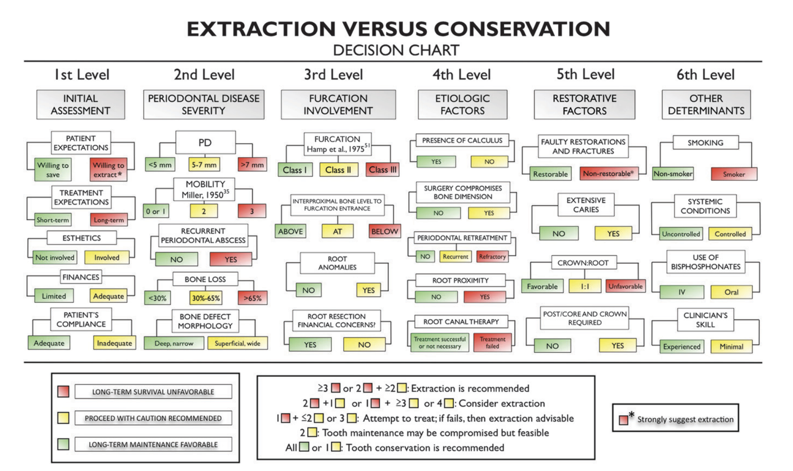

Smart Oral-Health Tools

This page shares small, focused web tools for clinicians, researchers, and health leaders.

Products
Tooth Restorability (Beta)
```{r}

```
Assess restorability using Avila et al. (2009) criteria.
Open the app: https://rcdy6v-abdulrahman-sh0.shinyapps.io/Tooth-Restorability_App/


How to use

Click a product link.

Follow the instructions on the tool page.

Send feedback about issues or ideas.

Contact

Email: alshehriabdulrahman3@student.usm.my

GitHub: https://github.com/AlShehriUSM

Built by Abdulrahman Alshehri